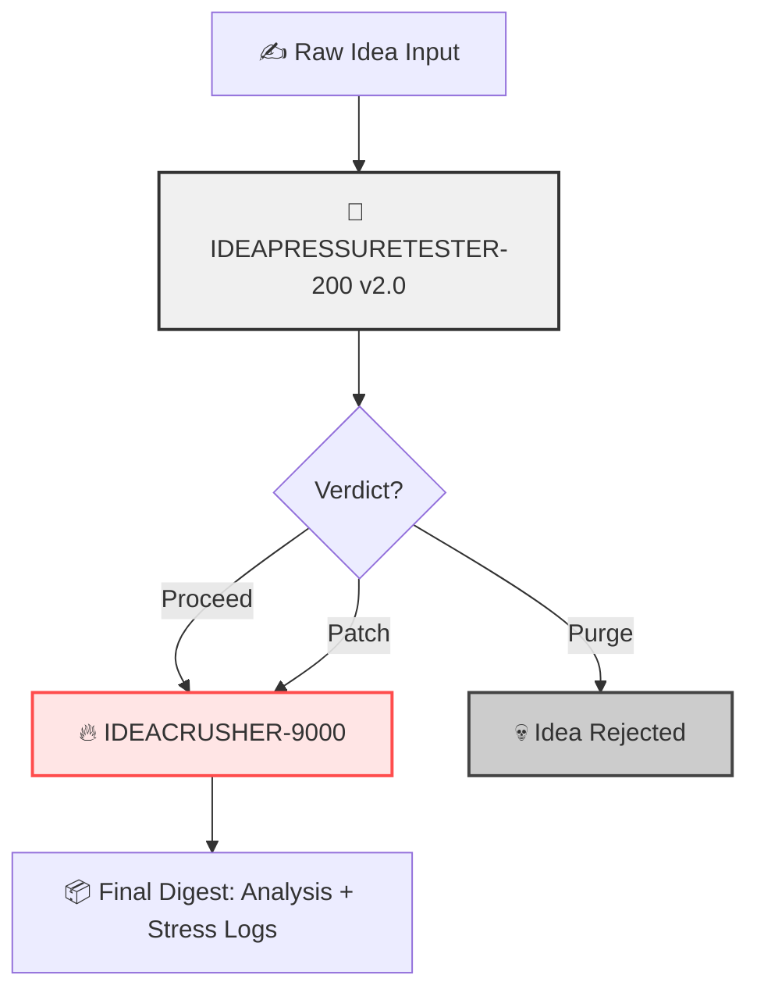

# 🧠 IDEA_TORTURE_PIPELINE Flow Guide

## 📜 Table of Contents

- [🚀 Overview](#-overview)
- [🔄 Pipeline Stages](#-pipeline-stages)
- [🦋 Visual Flow Map](#-visual-flow-map)
- [🔧 Use Case Examples](#-use-case-examples)
- [📎 Notes](#-notes)

---

## 🚀 Overview

This is a dual-phase interrogation pipeline that pressure-tests new ideas using two brutal evaluation models:

1. **IDEAPRESSURETESTER-200 v2.0** – Precision scrutiny engine
2. **IDEACRUSHER-9000** – Hostile mockery gauntlet

---

## 🔄 Pipeline Stages

1. ✍️ **Input Idea** → submit via interface, form, or GPT trigger
2. 🔍 **IDEAPRESSURETESTER-200** → runs a 4-axis logical vetting
3. 🧾 **Verdict**:
    - ✅ Proceed → escalates to Crusher
    - ⚠️ Patch → escalates to Crusher
    - ❌ Purge → pipeline ends
4. 💣 **IDEACRUSHER-9000** → initiates rhetorical combat and failure simulation
5. 📦 **Digest Output** → unified log with forensics + psychological durability report

---

## 🦋 Visual Flow Map

---

## 🔧 Use Case Examples

- 🔍 *Validating SaaS product concepts pre-pitch*
- 🧪 *Stress-testing moonshot ideas before VC meetings*
- 🎭 *Roleplaying worst-case market reactions*

---

## 📎 Notes

- Requires orchestration wrapper to manage the sequential logic.
- Designed for non-coddling environments where precision > feelings.
- Ideal for founders, strategists, or high-stakes creative teams.

---

> **🛑 Disclaimer**  
> This README was generated using the README Synth GPT, a tool designed to convert user-authored documentation, design logic, and development notes into clear, publishable Markdown.  
> All ideas, descriptions, and feature logic originated from the creator of this tool.  
> README Synth GPT structured, refined, and formatted the content—but it did not invent the product, its claims, or its language.  
> For full transparency on how this system works, see the GitHub project: README Synth GPT →
